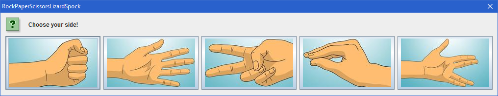
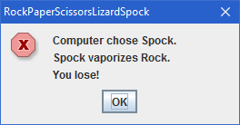
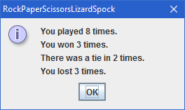

# Rock Paper Scissors (Lizard Spock)

Remake of the classic game. You can play with or without the Lizard Spock expansion.

I created this game because I could not find a simple and convenient enough game for this type.

Computer chooses its option randomly.

You can close the dialog with options (first ss) to give up and jump to the statistics (last ss).

 

## Installation

Built by NetBeans 8.2 (whole repository is the NetBeans project).

## Contribution

Feel free to contribute.

## Distribution

You can distribute this software (jar file in the dist folder) freely under GNU GPL v3.0.